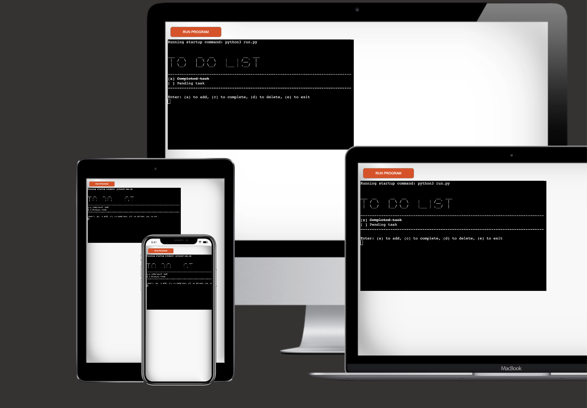
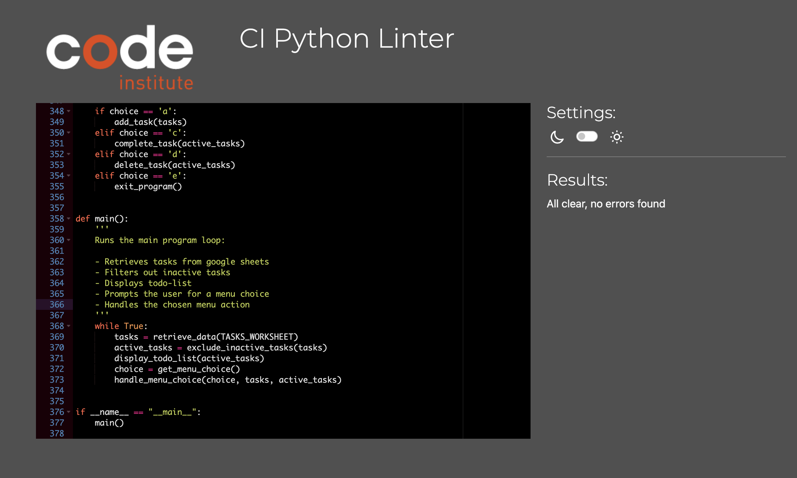

# To-Do-List
A terminal-based productivity tool designed for managing tasks with a simple and intuitive interface.  
 Users can create, update, delete, and mark tasks as complete, with real-time synchronization to Google Sheets for secure, persistent data storage.



## Live Demo

[View Here](https://daily-task-manager-14a85b9b3a54.herokuapp.com/)


## Table of Contents

* [Features](#features)
* [Data Storage](#data-storage)
* [Data Model](#data-model)
* [Flow Chart](#flow-chart)
* [Visual Design](#visual-design)
* [Installation](#installation)
* [Configuration Setup](#configuration-setup)
* [Deployment](#deployment)
* [Testing](#testing)
* [Technologies Used](#technologies-used)
* [Credits and Acknowledgments](#credits-and-acknowledgments)

## Features
### Main Interface
- Simple and clutter free design to foster productivity.
- Includes application heading, to-do list, and interactive menu. 
- Instantly reflects changes (added, completed, or deleted tasks) to user. 

### Task Management
(CRUD Operations)
  - **Create**: Add new tasks to the list.
  - **Read**: View tasks and track progress.
  - **Update**: Mark tasks as complete.
  - **Delete**: Remove tasks from the list.

### Status Tracking
Visual indicators for task progress:
- **To-do**: Empty checkbox, normal text.
- **Done**: Checked box and strikethrough text.

### Error Handling & Validation
- Validates all user input to ensure predefined rules and constraints are met.
- Provides user with helpful feedback for any missteps.

### Cloud Storage
- Utilizes Google Sheets to securely store and manage task data.
- Eliminates data loss risks with real-time API synchronization.
- Soft deletion ensures task history is preserved for review without cluttering the active to-do list.

### Live Demo
- Live demonstration available via a web-based mock terminal hosted on Heroku.  


## Data Storage  

[Google Sheets](https://workspace.google.com/products/sheets/)  
[Google Sheets API](https://developers.google.com/sheets/api/guides/concepts)  for cloud-based data management.  

| Field        | Type         | Description                                                  |  
|--------------|--------------|--------------------------------------------------------------|  
| `to_do_list` | Spreadsheet  | The primary Google Spreadsheet. |  
| `tasks` | Worksheet    | Worksheet containing all task-related data. |  


## Data Model

The `tasks` worksheet holds detailed information about each task. The fields are structured as follows:  

| Field      | Type   | Description                                   |  
|------------|--------|-----------------------------------------------|  
| `item_id`  | int    | A unique identifier for each task |  
| `name`     | str    | The name or description of the task.          |  
| `done`     | bool   | Indicates whether the task is completed (`True`) or not (`False`). |  
| `active`   | bool   | Indicates whether the task is active (`True`) or inactive (`False`), enabling soft deletion. |  
| `created_on` | datetime | Timestamp of task creation. | 


## Flow Chart


Flow chart created using [Mermaid Chart](https://www.mermaidchart.com/) 

## Visual Design
Layout constraints (80 col x 24 rows) was taken under consideration during design phase

### Heading

```
___  __      __   __             __  ___
 |  /  \    |  \ /  \    |    | /__`  | 
 |  \__/    |__/ \__/    |___ | .__/  |
```
Heading created using [ASCII Generator](https://www.asciiart.eu/text-to-ascii-art)  
Font used: JS Stick Letters


### List Container
```
--------------------------------------------------------------------------------
Empty
--------------------------------------------------------------------------------
```

### Status Symbols

**Complete**
```
[x]
```
**Incomplete**
```
[ ]
```
### Strikethrough text
```
 W̶a̶t̶e̶r̶ ̶p̶l̶a̶n̶t̶s̶
```
Found resource on how to accomplish strikethrough text here -> [Stackoverflow Thread](https://stackoverflow.com/questions/25244454/python-create-strikethrough-strikeout-overstrike-string-type)

## Installation

### 1. Fork the Repository  
- Navigate to the GitHub repository for this project.  
- Click the **Fork** button in the top-right corner to create a copy of the repository under your account.  
### 2. Set Up Google Sheet  
- Create a new Google Sheet named **to_do_list**.  
- Within the sheet, create a worksheet named **tasks**.  
- Structure the worksheet to follow the data model:  
   - **Columns**: `item_id`, `name`, `done`, `active`, `created_on`.  


### 3. Set Up Google Cloud Console Project  
- Visit the [Google Cloud Console](https://console.cloud.google.com/).  
- Create a new project and name it appropriately (e.g., "to-do-list-app").  
- Navigate to **APIs & Services > Library** and enable the following APIs:  
   - **Google Drive API**  
   - **Google Sheets API**  

### 4. Retrieve Service Account Credentials  
- In the Google Cloud Console, go to **APIs & Services > Credentials**.  
- Click **Create Credentials > Service Account**.  
- Fill in the required details and create the service account.  
- Once created, click the service account and navigate to the **Keys** tab.  
- Click **Add Key > Create New Key** and select **JSON**.  
- Download the credentials file. This file is required for authentication.  

### 5. Set Up Credentials  
- **For Deployment**: View deployment step 4.
- **For Local Development**:  
  - Place the downloaded credentials file in the root directory of your project.  
  -  Rename the file to `creds.json`.  

### 6. Grant Access to Google Sheet  
- Open the Google Sheet created in Step 2.  
- Share the sheet with the service account email address found in the `client_email` field of the credentials file.  
- Grant **Editor** access to ensure the app can read and modify the sheet.  

### 7. Install Required Dependencies  
Run the following command in your terminal to install the required dependencies:  
```bash
pip3 install -r requirements.txt
```


## Deployment


### 1. Create a Heroku App
- Log in to your Heroku account and click **New > Create New App**.  
- Choose a unique name for your app and select the appropriate region.  

### 2. Connect to GitHub Repository 
- In the Heroku dashboard, go to the **Deploy** tab.  
- Under **Deployment Method**, select **GitHub** and connect your Heroku app to your GitHub repository.  

### 3. Add Heroku Buildpacks
- In the **Settings** tab of your Heroku app, scroll to **Buildpacks**.  
- Add the following buildpacks in the specified order:  
     1. **Python**  
     2. **Node.js**  

### 4. Add Configuration Variables 
- Still in the **Settings** tab, locate **Config Vars** and click **Reveal Config Vars**.  
- Add the following key-value pairs:  
   - **CREDS**: Service credential file (JSON) for Google Sheets API authentication.  
   - **PORT**: Set to `8000`.  

### 5. Deploy the App 
- Return to the **Deploy** tab and scroll to the **Manual Deploy** section.  
- Select the main branch and click **Deploy Branch**.  
- Once the deployment completes, the app will be accessible via the Heroku-hosted link.  

### Notes  
- Ensure that your `requirements.txt` file includes all necessary Python dependencies.  
- The `runtime.txt` file should specify the Python version for compatibility.  
- The Node.js dependency is required to support the mock terminal interface.  


## Testing

### Manual Testing

The application underwent thorough manual testing to ensure its functionality, usability, and reliability. Below is a summary of the test cases conducted:

| **Test Case**                         | **Scenario**                                                                                   | **Expected Outcome**                                                      | **Result**   |  
|---------------------------------------|-----------------------------------------------------------------------------------------------|----------------------------------------------------------------------------|--------------|  
| **Add Task**                          | User enters a new task name.                                                                  | Task is added to the list and displayed in the terminal with `[ ]` status. | ✅ Passed    |  
| **Add Empty Task**                    | User attempts to add an empty task name.                                                      | Error message displayed: *"Task name cannot be empty."*                   | ✅ Passed    |  
| **Mark Task as Complete**             | User selects a task to mark as completed.                                                     | Task status updated to `[x]`, and task name appears with strikethrough.   | ✅ Passed    |  
| **Complete Non-Existent Task**        | User attempts to mark a task not present in the list.                                         | Error message displayed: *"Task not found."*                              | ✅ Passed    |  
| **Delete Task**                       | User chooses a task to delete from the list.                                                  | Task removed from the list and no longer displayed in the terminal.       | ✅ Passed    |  
| **Delete Non-Existent Task**          | User tries to delete a task that does not exist.                                              | Error message displayed: *"Task not found."*                              | ✅ Passed    |  
| **Soft Deletion Check**               | User deletes a task and views the data in Google Sheets.                                      | Task marked as inactive and remains in the data for historical purposes.  | ✅ Passed    |  
| **View Empty List**                   | User views the task list when no tasks are present.                                           | Message displayed: *"Empty"*                                               | ✅ Passed    |  
| **Real-Time Sync**                    | User performs any CRUD operation and checks the Google Sheets data.                          | Changes instantly reflected in Google Sheets.                             | ✅ Passed    |  
| **Invalid User Input**                | User enters invalid input for menu selection or task operations.                              | Error message displayed: *"Invalid menu choice. Please try again!"*       | ✅ Passed    |  
| **Task List Overflow**                | User adds tasks beyond the visible limit of the terminal screen size (80x24).                | List scrolls or displays tasks in paginated sections.                     | ✅ Passed    |  

### PEP8 Validation
To ensure that the code adheres to PEP 8 standards.




## Technologies Used

| Technology | Description | Link ↘ |
|-|-|-|
| Python Essentials Template | Template that includes mock terminal functionality for the app | [Link](https://github.com/Code-Institute-Org/python-essentials-template) |
| Python | Primary programming language used | [Link](https://www.python.org/) |
| Google Sheets | Cloud-based spreadsheet tool for managing task data | [Link](https://workspace.google.com/products/sheets/)|
| Google Drive API | API that enables interaction with Google Drive, used for accessing Google Sheets data | [Link](https://developers.google.com/drive/api/guides/about-sdk) |
 Google Sheets API | API that allows reading and writing data to Google Sheets, used for task storage | [Link](https://developers.google.com/sheets/api/guides/concepts) |
| google-auth | Authentication library for securely connecting to Google APIs using service account credentials | [Link](https://google-auth.readthedocs.io/en/master/) |
| gspread | Python library for interacting with Google Sheets API, used for managing task data | [Link](https://docs.gspread.org/en/v6.1.3/)|
| datetime | Python library used for task creation timestamps | [Link](https://docs.python.org/3/library/datetime.html#) |
| Heroku | 	Hosting platform used to deploy the app for public access | [Link](https://www.heroku.com/) |


## Credits and Acknowledgments

